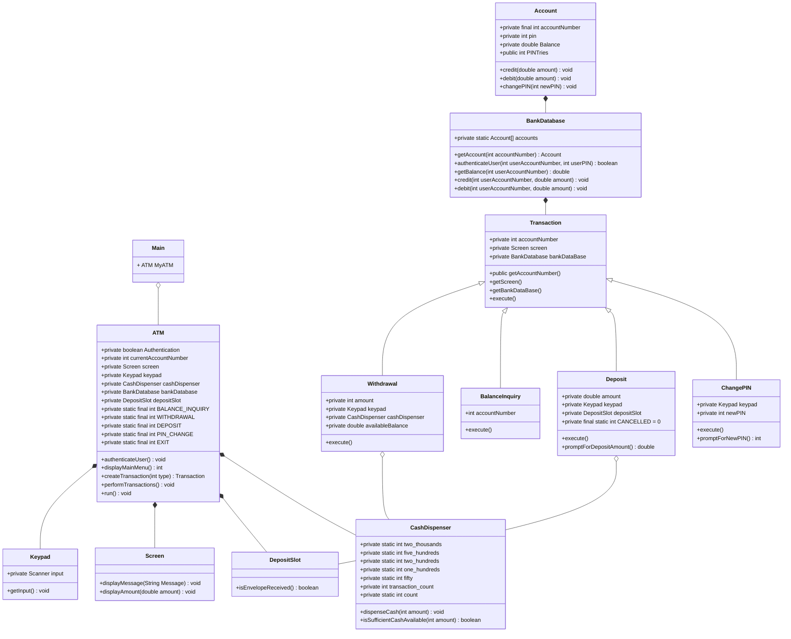

# CASE STUDY 2 : ATM

###### Made by : Chetan Moturi (CS21B017)

This project is made entirely on java and utilizes the 
various object oriented programming concepts we have learned 
until now.

This project aims to imitate the working of an ATM 
as much as possible. 

The ATM consists of funcionalities like withdrawal, 
deposit and changing pin.

It also includes use of access specifiers for security of 
information.


## Features

The ATM consists of the following features:
- Withdrawal
- Deposit
- Check Balance / Transactions
- Change PIN


## Code

The code is split into various different classes. 
A list is given below :

| S.No. | Class |
|:-----:|:-----------:|
|     01|      [MAIN](https://github.com/octochet/ATM/blob/main/README.md#main)  |
|     02|      ATM      |
|     03|    ACCOUNT    |
|     05| BANK DATABASE |
|     12|  TRANSACTION  |
|     13|   WITHDRAWAL  |
|     06| CASH DISPENSER|
|     08|    DEPOSIT    |
|     09| DEPOSIT SLOT  |
|     04|BALANCE INQUIRY|
|     07|   CHANGE PIN  |
|     10|     KEYPAD    |
|     11|     SCREEN    |

### MAIN
Contains the Main Driver code which will run the ATM. The 
method used is,
```
ATM MyATM = new ATM();
MyATM.run();
```
### ATM
Contains authentication, main menu and perform transactions methods.
All of this is utilized in the run method which will run the ATM. 

The methods are listed below ,
```
private void authenticateUser()
private int displayMainMenu()
private Transaction createTransaction(int MainMenuChoice)
private void performTransactions()
public void run()
```
### ACCOUNT 
Contains basic account information such as, account number, pin, balance and 
number of pin tries/fails.

Methods include:
```
public boolean ValidatePin(int userPIN)
public double getBalance()
public int getAccountNumber()
public void credit(double amount)
public void debit(double amount)
public void changePIN(int newPIN)
```
### BANK DATABASE
Contains information regarding accounts, gets account, authentication and etc.

Methods are:
```
static Account getAccount(int accountNumber)
public boolean authenticateUser(int userAccountNumber, int userPIN)
```

### TRANSACTION
It is an Abstract class which is used for executing different types of transactions.

It will be inherited to different types of transactions listed in main menu
such as deposit and withdrawal.

### WITHDRAWAL
It inherits transaction abstract class and is used for withdrawing money from the ATM.
It has a limit on withdrawal amount and utilizes the cash dispenser to output the required number of denomination
notes.

### CASH DISPENSER
Contains fields for the amount of notes inside the ATM, Has the dispense cash method which
will calculate what currency notes will be required for the withdrawal amount 
and out the number of notes with respective denominations.
It also checks if it has sufficient cash to facilitate a withdrawal or not.
```
public void dispenseCash(int amount)
public boolean isSufficientCashAvailable( int amount)
```
### DEPOSIT
It inherits transaction abstract class and is used for depositing envelopes in the ATM.
It makes use of the deposit slot in the ATM to check if the envelope is recieved or not.

It has the following method to get deposit amount , 
```
private double promptForDepositAmount()
```
### DEPOSIT SLOT
Checks if envelope is recieved or not.

### BALANCE INQUIRY
Prints the Account information and Balance available in the account. It also inherits the abstract class Transaction.

### CHANGE PIN 
It extends the abstract class transaction. It asks for a new PIN from the user 
twice for cofirmation and updates it using the update pin method in account. It also has
the cancel feature incase the user wants to not change the PIN.

It contains the method, 
```
private int promptForNewPIN()
```
for getting the new PIN input from keypad.

### KEYPAD 
It is a utility class to imitate a real ATM's keypad. It takes input in the form of
digits from the user.
```
public int getInput()
```

### SCREEN
It is also a utility class to imitate a real ATM'S screen. It is used to display messages on the screen
using the method,
```
public void displayMessage(String Message)
public void displayAmount(double amount)
```


## Class Diagram


