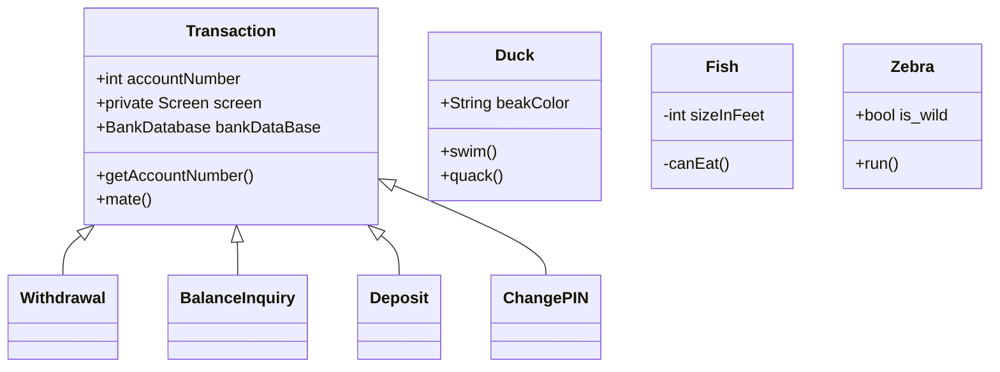

# CASE STUDY 2 : ATM

###### Made by : Chetan Moturi (CS21B017)

This project is made entirely on java and utilizes the 
various object oriented programming concepts we have learned 
until now.

This project aims to imitate the working of an ATM 
as much as possible. 

The ATM consists of funcionalities like withdrawal, 
deposit and changing pin.

It also includes use of access specifiers for security of 
information.


## Features

The ATM consists of the following features:
- Withdrawal
- Deposit
- Check Balance / Transactions
- Change PIN


## Code

The code is split into various different classes. 
A list is given below :

| S.No. | Class |
|:-----:|:-----------:|
|     01|      [MAIN](https://github.com/octochet/ATM/blob/main/README.md#main)  |
|     02|      ATM      |
|     03|    ACCOUNT    |
|     05| BANK DATABASE |
|     12|  TRANSACTION  |
|     13|   WITHDRAWAL  |
|     06| CASH DISPENSER|
|     08|    DEPOSIT    |
|     09| DEPOSIT SLOT  |
|     04|BALANCE INQUIRY|
|     07|   CHANGE PIN  |
|     10|     KEYPAD    |
|     11|     SCREEN    |

### MAIN
Contains the Main Driver code which will run the ATM. The 
method used is,
```
MyATM.run();
```
### ATM


## Class Diagram


